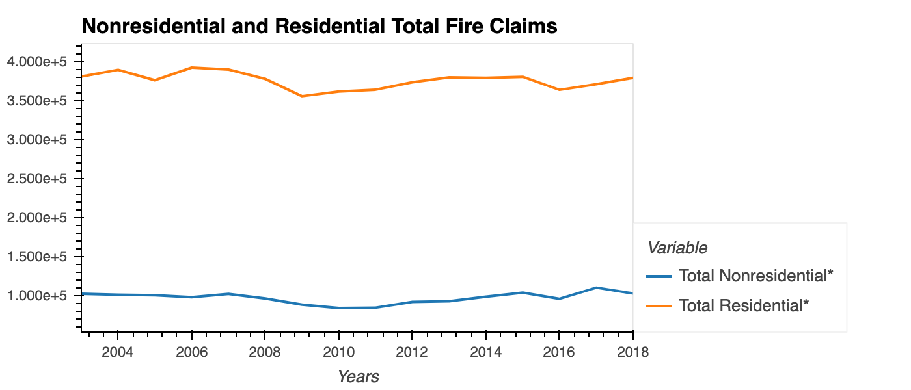

# Fire and Flood Insurance and Investment Firm Strategies

#### Preston, Ghazi, Ann, Dean, Arnold

## Project Description/Outline

We will analyze the historical data of floods and fires related to claims paid and premiums charged by the insurance company. We will look at how many times a year floods and fires occur in the US (frequency). We will look at total amounts paid out in claims and the average amount paid per claim (severity). This will allow us to predict a pricing structure per insurance line (premiums) to be profitable and have funds to invest. What should we inveset in to maximize returns? 

## Research Questions to Answer

What does a map of flood disasters look like? 

* See dashboard for flood 2003-2018 geographical representation. 

What is the serverity and frequency of flood and fire damages in the US? How much and how often do we have to payout for fires and flood? 

    

For fire damages residential was consistently higher. 

Average cost per claim? On average what premium should we charge to be a profitable insurance company?
    
  We experienced higher cost per claim for nonresidential properties.
  
  
    
Given a 80% Loss Ratio what are our yearly investments? 

res_initial_investment
nonres_initital_investment
    
    
What is are the risks of flood each state? 
    
* Reference google flood map (Ghazi)

Show Dashboard of metrics

## Datasets to Be Used

* Fire Analysis data from "fire_loss_estimates" (Nonres_Fire_Dollr_Loss_by_Cause.csv, Res_Bld_Fire_Dollr_Est_by_Cause.csv, Nonres_Bldg_Fire_Est_by_Cause.csv, Res_Bldg_Fire_Est_by_Cause.csv)
from https://www.usfa.fema.gov/data/statistics/order_download_data.html#download

* Flood Analysis data from ""
from https://www.fema.gov/about/openfema/data-sets#misc

## Rough Breakdown of Tasks

Find data on fire, flood on last 10+ years. 
Clean data -- explain what and why
Plot metrics to show figures
Build dashboards and heat maps
Draw Conclusions

# Discussion/Analysis

* Data Analysis

  * Discuss the steps you took to analyze the data and answer each question you asked in your proposal.
  Sliced data over 2003-2018 year periods showing us claims data and dollar amounts in US for primary residents. We were able to find how often floods/fires occur per year the amounts paid on those floods and fires. Leading us to gather averages and determine claims average costs. This lead us to develop a risk of 80% and calculate preimums needed to achieve 20% surplus and then invest into the open markets.
  * Present and discuss interesting figures developed during analysis, ideally with the help of Jupyter Notebook.
  House always wins in law of averages. Some years we pay more some we pay less however long term investing strategy. 

* Discussion
    * Discuss your findings. Did you find what you expected to find? If not, why not? What inferences or general conclusions can you draw from your analysis?

Residential fires occur more frequent and less severe in total overall dollar amount. 

Flood concludes that north east and south east regions have higher risk of floods nationwide.

* Postmortem

  * Discuss any difficulties that arose, and how you dealt with them.
  * Discuss any additional questions that came up, but which you didn't have time to answer: What would you research next, if you had two more weeks?

Fire data related to the state just like we did with flood data. Also would create map for fires if we had lon. and lat. lines. 

Had a few issues with building dashboard for such large number differences. 

* Questions
  * Open-floor Q&A with the audience